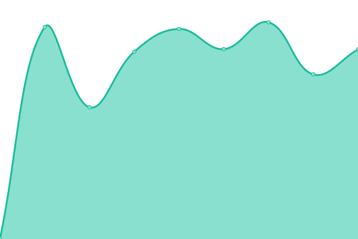

# [📈 Live Status](https://gloriousDan.github.io/Homelab-uptime): <!--live status--> **🟧 Partial outage**

This repository contains the open-source uptime monitor and status page for [Daniel](https://gloriousDan.github.io/Homelab-uptime), powered by [Upptime](https://github.com/upptime/upptime).

With [Upptime](https://upptime.js.org), you can get your own unlimited and free uptime monitor and status page, powered entirely by a GitHub repository. We use [Issues](https://github.com/gloriousDan/Homelab-uptime/issues) as incident reports, [Actions](https://github.com/gloriousDan/Homelab-uptime/actions) as uptime monitors, and [Pages](https://gloriousDan.github.io/Homelab-uptime) for the status page.

<!--start: status pages-->
<!-- This summary is generated by Upptime (https://github.com/upptime/upptime) -->
<!-- Do not edit this manually, your changes will be overwritten -->
<!-- prettier-ignore -->
| URL | Status | History | Response Time | Uptime |
| --- | ------ | ------- | ------------- | ------ |
|  Rezepte | 🟩 Up | [rezepte.yml](https://github.com/gloriousDan/Homelab-uptime/commits/HEAD/history/rezepte.yml) | 

 1374ms
     
 | 

<a href="https://gloriousDan.github.io/Homelab-uptime/history/rezepte">99.70%</a>
    

|  Nextcloud | 🟩 Up | [nextcloud.yml](https://github.com/gloriousDan/Homelab-uptime/commits/HEAD/history/nextcloud.yml) | 

 1709ms
     
 | 

<a href="https://gloriousDan.github.io/Homelab-uptime/history/nextcloud">99.70%</a>
    

|  Avv Abfahrten list | 🟥 Down | [avv-abfahrten-list.yml](https://github.com/gloriousDan/Homelab-uptime/commits/HEAD/history/avv-abfahrten-list.yml) | 

 0ms
     
 | 

<a href="https://gloriousDan.github.io/Homelab-uptime/history/avv-abfahrten-list">0.00%</a>
    

|  Traefik personal domain | 🟥 Down | [traefik-personal-domain.yml](https://github.com/gloriousDan/Homelab-uptime/commits/HEAD/history/traefik-personal-domain.yml) | 

 0ms
     
 | 

<a href="https://gloriousDan.github.io/Homelab-uptime/history/traefik-personal-domain">0.00%</a>
    

|  Traefik | 🟥 Down | [traefik.yml](https://github.com/gloriousDan/Homelab-uptime/commits/HEAD/history/traefik.yml) | 

 0ms
     
 | 

<a href="https://gloriousDan.github.io/Homelab-uptime/history/traefik">0.00%</a>
    

<!--end: status pages-->

[**Visit our status website →**](https://gloriousDan.github.io/Homelab-uptime)

## 📄 License

- Powered by: [Upptime](https://github.com/upptime/upptime)
- Code: [MIT](./LICENSE) © [Daniel](https://gloriousDan.github.io/Homelab-uptime)
- Data in the `./history` directory: [Open Database License](https://opendatacommons.org/licenses/odbl/1-0/)
